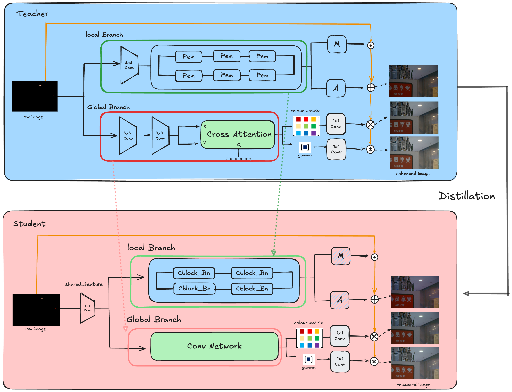
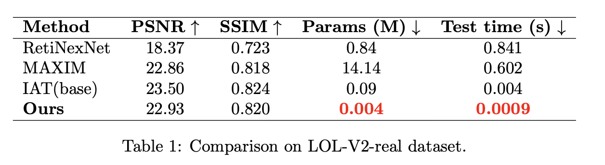

# <font> Fast Low-Light Image Enhancement via Convolutions and Knowledge Distillation</font> 
<br/>

"Thanks to Byori Kim, Dongkyun Woo, and Bokyung Byun for their contributions"

<br/>

## Abstract
Recent low-light image enhancement models have achieved remarkable performance. However, diffusion-based methods, which have become popular recently, suffer from long inference times, making them unsuitable for real-time applications. Fast inference is particularly critical in domains such as autonomous driving, where low-light enhancement models must operate efficiently.

To address this, we design a low-light enhancement model that maintains high performance while achieving rapid inference. [The Illumination Adaptive Transformer (IAT, BMVC 2022)](https://github.com/cuiziteng/Illumination-Adaptive-Transformer) provides an efficient architecture for fast low-light enhancement. Building upon this baseline, we introduce several improvements—including multi-level distillation, shared convolutions, and the replacement of layer normalization with batch normalization—which preserve enhancement quality while accelerating inference by approximately four times.

We evaluate the complete pipeline on the LOL-v2 dataset, and the performance comparison is summarized in the table below.

<div align="center">
  
</div>
<p align="center">
  Figure 1: Overall pipeline of our method. The teacher model corresponds to IAT (BMVC 2022), while the student model is designed and trained via multi-level distillation.
</p>

<table>
  <tr>
    <td align="center">
      <br>
    </td>
    <td align="center">
      <br>
    </td>
  </tr>
</table>

<br/>

## Demo:
<div align="center">
  
</div>
<p align="center">
  Figure 3: Example Outputs at Each Stage: IAT vs. Our Model
</p>

## Usage:

Enviroment (install pytorch 1.7.1 or later, following [pytorch](https://pytorch.org/).):
```
$ conda create -n IAT python==3.7.0
$ conda activate IAT
$ conda install --yes -c pytorch pytorch=1.7.1 torchvision cudatoolkit=11.0
$ pip install timm matplotlib IQA_pytorch tqdm ptflops
$ cd IAT_enhance
```

inference image with Ours
```
python img_demo.py --input_image [input_image_path]
```

Intermediate results comparison between the baseline model and Ours

```
python inference_comparision.py --input_image [input_image_path] --teacher_path ./ckpts/base_IAT/best_Epoch_lol.pth --student_path ./ckpts/IAT_student/student_best.pth
```

Train model
```
python train.py  --teacher_path ./ckpts/base_IAT/best_Epoch_lol.pth --img_path [image_path] --img_val_path [image_val_path]
```
<br/>


